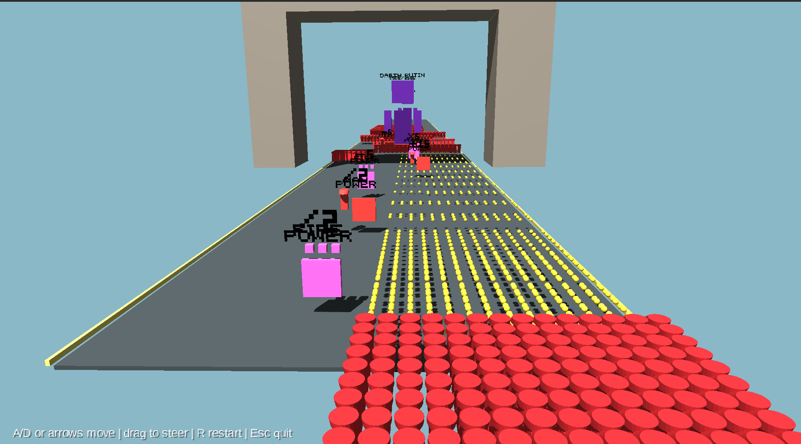

# Crowd Master Arcade




A Kotlin/libGDX prototype for the crowd defense runner described in `SPEC.md`.


[](https://snapcraft.io/crowd-master-arcade)


## Run

```bash
GRADLE_USER_HOME=.gradle-user gradle :lwjgl3:run
```

Run with external textual levels:

```bash
GRADLE_USER_HOME=.gradle-user gradle :lwjgl3:run -Dlevels.dir=/path/to/levels
```

## Test

```bash
GRADLE_USER_HOME=.gradle-user gradle test
```

Controls:

- `A` / left arrow: move left
- `D` / right arrow: move right
- mouse/touch drag: steer horizontally
- `N`: load next level
- `R`: restart
- `Esc`: quit

## Level Format

Levels are text files with a small YAML-like format. Bundled levels live in
`core/src/main/resources/levels` and are listed in `levels/index.txt`.

```yaml
name: The Raven's Bend
road_length: 220
road_width: 8
starting_soldiers: 10
fire_rate: 1.2
projectile_pool: 768
projectile_length: 80
soldier_model: assets/default-soldier.obj
boss_model: assets/default-boss.obj
manpower_card_model: assets/default-manpower-card.obj
firepower_card_model: assets/default-firepower-card.obj

cards:
  - op: plus, param: manpower, val: 10, x: -2, z: 28
  - op: minus, param: manpower, val: 5, x: 2, z: 44
  - op: times, param: firepower, val: 2, x: -1.5, z: 60
  - op: div, param: manpower, val: 2, x: 1.5, z: 76
  - op: times, param: firepower, val: 3, x: 0, z: 96

decorations:
  - name: triumphal arch, power 999999, x: 0, z: 95, model: assets/triumphal-arch.obj

enemy_brigades:
  - name: vanguard, effective: 20, strength: 10, x: 0, z: 88
  - effective: 20, strength: 12, x: 1.4, z: 132

bosses:
  - name: General Raven, power: 400, x: 0, z: 190
  - power: 400, x: 0, z: 380
```

Default OBJ assets live in `core/src/main/resources/assets`. They are centered
reference boxes with explicit bounding boxes in comments, so replacement models
can be authored to the same dimensions without hidden scaling.

`projectile_length` controls how far bullets travel before expiring. Enemy
`strength` controls each enemy unit's health. Boss and brigade names are
optional; defaults are `General N` and `brigade N`.

Decorations are visual scenery only. They are transparent to projectiles and
characters, do not shield units, and do not affect gameplay collisions. Missing
decoration models fall back to a cube.
